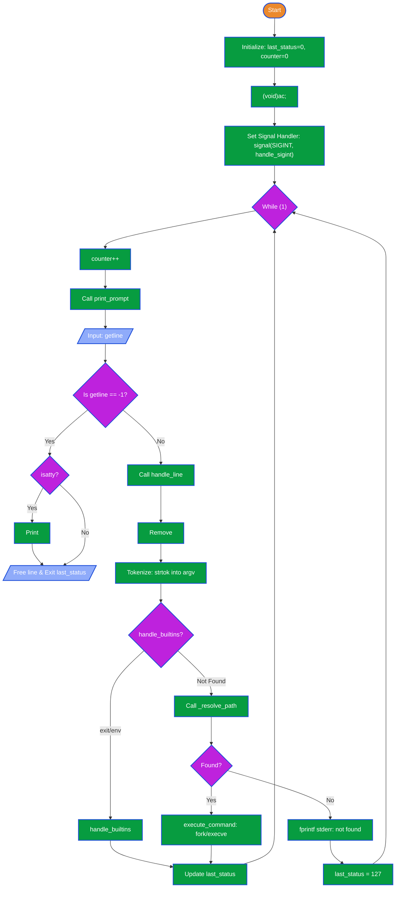

<<<<<<< HEAD
# holbertonschool-simple_shell

A simple UNIX command line interpreter written in C. This project is a functional recreation of the `sh` shell, designed to interface between the user and the Linux kernel.

## Description

This shell implements the fundamental **Read-Parse-Execute** loop. It captures user input, tokenizes it into arguments, resolves the command location through the system `PATH`, and manages process creation using `fork`, `execve`, and `wait`.

## Logic Flow

The following diagram illustrates the internal architecture of the shell, from the initial prompt to the execution of built-ins and external programs.



## ✨ Features

- **Interactive & Non-Interactive Modes**: Operates via terminal or piped input (e.g., `echo "ls" | ./hsh`).
- **Command Execution**: Runs executable programs from the `PATH` or using absolute/relative paths.
- **Built-in Commands**: Includes native support for `exit` (terminates shell) and `env` (prints environment).
- **PATH Resolution**: Locates executables automatically in system directories.
- **Signal Handling**: Gracefully handles `Ctrl+C` (`SIGINT`) to prevent unexpected exits.
- **Error Handling**: Displays error messages similar to `/bin/sh` with command counters.
- **Robust Memory Management**: Zero memory leaks verified via Valgrind.

## 📁 Files

- `shell.c` - Core shell loop and command processing logic
- `shell.h` - Header file with function declarations and structures
- `exec_functions.c` - Handles command execution via `fork` and `execve`
- `builtins.c` - Implements built-in commands (`exit`, `env`)
- `path_functions.c` - PATH resolution and executable search
- `signals.c` - Custom signal handling logic
- `_strlen.c` - String length utility
- `_strcmp.c` - String comparison utility
- `_strdup.c` - String duplication utility

## 🛠️ Requirements & Compilation

- **OS**: Ubuntu 20.04 LTS.
- **Compiler**: `gcc`.
- **Standards**: Compiled using `-std=gnu89`.
- **Style**: Follows the Betty coding standard.

To compile the shell, use the following command:

```bash
gcc -Wall -Werror -Wextra -pedantic -std=gnu89 *.c -o hsh
```

## Usage
Interactive Mode:
```bash
./hsh
#cisboring$ ls
#cisboring$ exit
```
Non-Interactive Mode:
```bash
$ echo "ls" | ./hsh
```

## 👤 Authors

- Gwendal Boisard
- Julian Gonzalez
- Djibril Tamsir Niang

## 📄 License

Holberton School Project
=======
# 🐚 holbertonschool-simple_shell

A simple UNIX command line interpreter written in C, implementing basic shell functionality.

## 📝 Description

This project recreates a minimal shell that reads user commands, parses them, and executes the corresponding programs. It supports basic features like command execution, PATH resolution, and built-in commands. The shell provides an interactive interface similar to `/bin/sh` with essential command-line functionality.

## ✨ Features

- **Command parsing and execution** - Tokenizes input and manages command arguments
- **PATH environment variable handling** - Locates executables in system PATH directories
- **Built-in commands** - Implements exit, env, and cd natively
- **Error handling and exit status management** - Returns appropriate exit codes
- **Support for absolute and relative paths** - Executes programs with full or partial paths
- **Interactive and non-interactive modes** - Works as both interactive shell and script processor

## 🔄 How It Works

```
┌─────────────────┐
│   Start Shell   │
└────────┬────────┘
         │
         ▼
┌─────────────────┐
│  Read Command   │
└────────┬────────┘
         │
         ▼
┌─────────────────┐
│  Parse Command  │
└────────┬────────┘
         │
         ▼
┌──────────────────────┐
│ Is Built-in Command? │
└─────┬──────────┬─────┘
      │ Yes      │ No
      ▼          ▼
 ┌────────┐  ┌──────────────┐
 │Execute │  │ Search PATH  │
 │Built-in│  └──────┬───────┘
 └────┬───┘         │
      │             ▼
      │        ┌──────────────┐
      │        │ Execute Prog │
      │        └──────┬───────┘
      │               │
      └───────┬───────┘
              │
              ▼
        ┌──────────────┐
        │Return Status │
        └──────┬───────┘
               │
               ▼
        ┌──────────────┐
        │  Exit? (y/n) │
        └─┬────────────┘
          │ No
          └─────────┐
                    └─→ Read Command
```

## 📦 Installation

```bash
gcc -Wall -Wextra -Werror -pedantic *.c -o hsh
```

Compilation flags enforce strict code standards and enable all warnings.

## 🚀 Usage

```bash
./hsh
```

Interactive mode reads commands from standard input until exit is called or EOF is reached.

## 📁 Files

- `shell.c` - Core shell loop and command processing logic
- `shell.h` - Header file with function declarations and structures
- `exec_functions.c` - Handles command execution via fork and execve
- `builtins.c` - Implements built-in commands (exit, env, cd)
- `path_functions.c` - PATH resolution and executable search
- `signals.c` - Signal handling
- `_strlen.c` - String length utility
- `_strcmp.c` - String comparison utility
- `_strdup.c` - String duplication utility

## 👤 Authors

- Gwendal Boisard

## 📄 License

Holberton School Project

>>>>>>> 8a971c7fdfb9fe05cfb926b1b6abf3cb675b1f87
